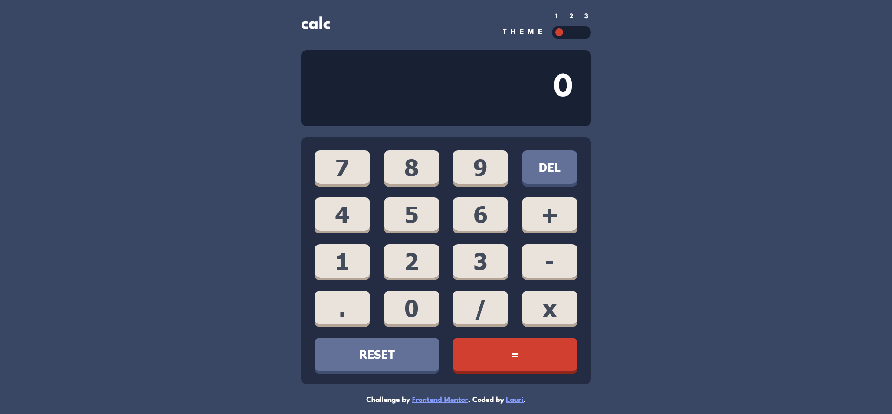

# Frontend Mentor - Calculator app solution

This is a solution to the [Calculator app challenge on Frontend Mentor](https://www.frontendmentor.io/challenges/calculator-app-9lteq5N29). Frontend Mentor challenges help you improve your coding skills by building realistic projects. 

## Table of contents

- [Overview](#overview)
  - [The challenge](#the-challenge)
  - [Screenshot](#screenshot)
  - [Links](#links)
  - [Built with](#built-with)

## Overview

### The challenge

Users should be able to:

- See the size of the elements adjust based on their device's screen size
- Perform mathmatical operations like addition, subtraction, multiplication, and division
- Adjust the color theme based on their preference
- **Bonus**: Have their initial theme preference checked using `prefers-color-scheme` and have any additional changes saved in the browser

### Screenshot

### Links

- Solution URL: [frontendmentor.io](https://www.frontendmentor.io/solutions/calculator-with-multible-themes-using-jquery-sass-css-grid-HkFaiQKLc)
- Live Site URL: [github.io](https://lvastisson.github.io/calculator-app-main/src/index.html)

### Built with

- HTML5
- jQuery
- Sass
- CSS custom properties
- Flexbox
- CSS Grid