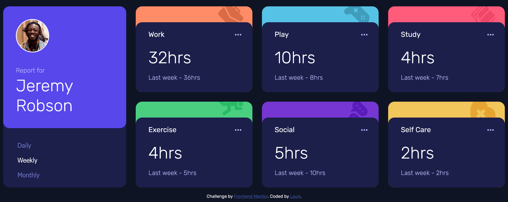

# Frontend Mentor - Time tracking dashboard solution

This is a solution to the [Time tracking dashboard challenge on Frontend Mentor](https://www.frontendmentor.io/challenges/time-tracking-dashboard-UIQ7167Jw). Frontend Mentor challenges help you improve your coding skills by building realistic projects. 

## Overview

### The challenge

Users should be able to:

- View the optimal layout for the site depending on their device's screen size
- See hover states for all interactive elements on the page
- Switch between viewing Daily, Weekly, and Monthly stats

### Screenshot

### Links

- Solution URL: [frontendmentor.io](https://www.frontendmentor.io/challenges/time-tracking-dashboard-UIQ7167Jw/hub/responsive-dashboard-using-css-grid-HymtFYLU9)
- Live Site URL: [https://lvastisson.github.io/time-tracking-dashboard-main/src/index.html](https://lvastisson.github.io/time-tracking-dashboard-main/src/index.html)

## My process

### Built with

- Vanilla JS
- HTML5
- Sass
- CSS Grid
